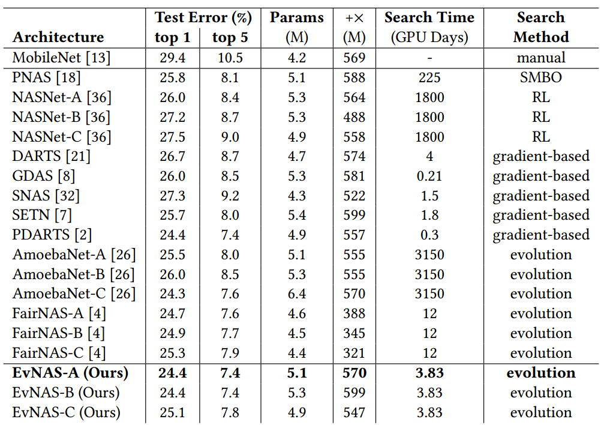
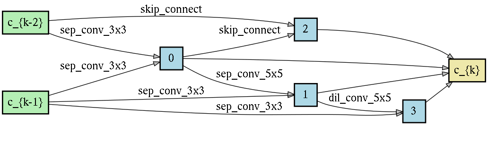

# Evolution of Neural Architecture Search with Weight Sharing

**This code is based on the implementation of  [DARTS](https://github.com/quark0/darts).**
**The training code for the ImageNet dataset is taken from [P-DARTS](https://github.com/chenxin061/pdarts)**


## Requirements
```
Python >= 3.6.9, PyTorch == 1.5.0, torchvision == 0.6.0
```

## Introduction
This repository contains the code for our work called Evolving Neural Architecture Search using One Shot Model (EvNAS). In our method,
the architectures are represented by using the architecture parameter of the one-shot model which results in the weight sharing among
the architectures for a given population of architectures and also weight inheritance from one generation to the next generation of architectures.
We propose a decoding technique for the architecture parameter which is used to divert majority of the gradient information towards the
given architecture and is also used for improving the performance prediction of the given architecture from the one-shot model
during the search process. Furthermore, we use the accuracy of the partially trained architecture on the validation data as a prediction
of its fitness in order to reduce the search time.

## Pretrained models
**CIFAR-10** ([EvNAS_A_cifar_weights.pt](https://drive.google.com/file/d/1NFLOLLBwdq79QB2O4S7lXV4NL6Oho0ba/view?usp=sharing))
```
python3 test_cifar.py --arch EvNASA --model_path EvNAS_A_cifar_weights.pt
```
For EvNAS-B and EvNAS-C use EvNASB and EvNASC respectively for --arch option with their pretrained weigths
([EvNAS_B_cifar_weights.pt](https://drive.google.com/file/d/1zV1idPB0dZ3T8t5TwdCMHhMvvsK-yUW7/view?usp=sharing)),
([EvNAS_C_cifar_weights.pt](https://drive.google.com/file/d/17rU4zO_2l21-OdJLH9ffk-n8_xDFK7-M/view?usp=sharing))<br />
** Expected result for EvNAS-A: 2.40% test error rate (97.60% top-1 accuracy) with 3.6M model params. <br />
** Expected result for EvNAS-B: 2.51% test error rate (97.49% top-1 accuracy) with 3.8M model params.<br />
** Expected result for EvNAS-C: 2.55% test error rate (97.45% top-1 accuracy) with 3.4M model params.<br />

**ImageNet** ([EvNAS_A_imagenet_model_best.pt.tar](https://drive.google.com/file/d/15I5D2vkkGSOemAckxOqDfPCPTPsHeFRR/view?usp=sharing))
```
python test_imagenet.py --arch EvNASA --model_path EvNAS_A_imagenet_model_best.pth.tar
```
For EvNAS-B and EvNAS-C use EvNASB and EvNASC respectively for --arch option with their pretrained weigths
([EvNAS_B_imagenet_model_best.pt.tar](https://drive.google.com/file/d/1fpwY2fpioWFKmIFvC1DIZEamvdbT6ll5/view?usp=sharing))
([EvNAS_C_imagenet_model_best.pt.tar](https://drive.google.com/file/d/1ulQVVOAiHi6f-yst7XChxuT7QybbwB9Z/view?usp=sharing))<br />
** Expected result for EvNAS-A: 24.4% top-1 error (75.6% top-1 accuracy) and 7.4% (92.6% top-5 accuracy) top-5 error with 5.1M model params.<br />
** Expected result for EvNAS-B: 24.4% top-1 error (75.6% top-1 accuracy) and 7.4% (92.6% top-5 accuracy) top-5 error with 5.3M model params.<br />
** Expected result for EvNAS-C: 25.1% top-1 error (74.9% top-1 accuracy) and 7.8% (92.2% top-5 accuracy) top-5 error with 4.9M model params.<br />

## Architecture search (using CIFAR-10 dataset)
```
python -i train_search.py --cutout
```

## Architecture evaluation (using full-sized models)
To evaluate our best cells by training from scratch on CIFAR-10 dataset, run
```
python train.py --cutout --auxiliary --epochs 600 --arch EvNASA	    # when architecture is present in genotype.py
or
python train.py --cutout --auxiliary --epochs 600 --dir search_DIR # when architecture is in search_DIR as genotype.pickle file
```

## Results
#### CIFAR-10 Result

#### ImageNet Result


### Searched Cells
#### Normal Cell of EvNAS-A


#### Reduction Cell of EvNAS-A


